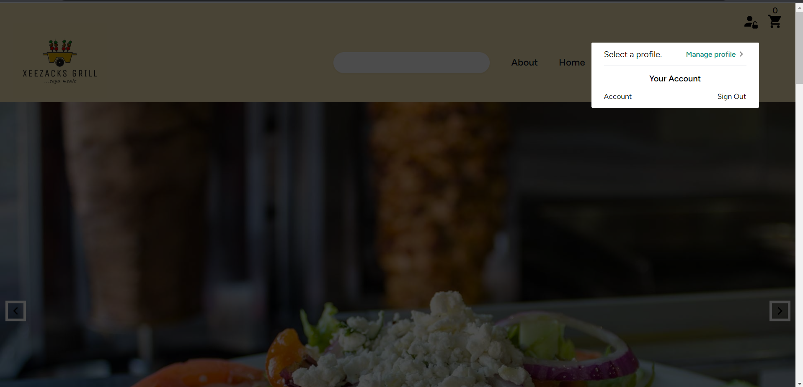
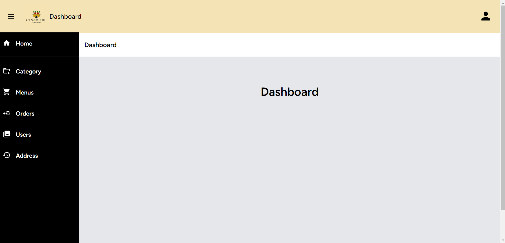

# XeezacksGrill Web Application

A modern web application for Xeezacks Grill, developed using Laravel Inertia, Vue 3 Composition API, TailwindCSS, and integrated with the Paystack payment gateway. The application features a fully functional shopping cart, favorite menu management, user authentication, and order tracking.

### Table of Contents

- Features
- Tech Stack
- Screenshots
- Installation
- Usage
- Project Status
- License

### Features

- Shopping Cart: Users can add, remove, and update items in their shopping cart. Real-time updates using Pinia store.
- Paystack Integration: Seamlessly integrated Paystack payment gateway for secure and convenient online payments.
- Favorite Menu: Users can save their favorite menu items. CRUD operations for managing favorite dishes.
- User Authentication: Secure user registration and login system with hashed passwords.
- Orders Tracking: Users can view their order history and track the status of their current orders.

### Tech Stack

- Frontend: Vue 3 Composition API, Inertia.js
- Styling: TailwindCSS
- State Management: Pinia
- Backend: Laravel
- Database: MySQL
- Payment Gateway: Paystack

### Screenshots of the project

### Installation

1 Clone the repository: git clone https://github.com/your-username/xeexacksgrill.git
2 Install dependencies:

composer install
npm install

3 Configure your .env file with database and Paystack API credentials.
4 Migrate and seed the database:

php artisan migrate --seed

### Usage

1 Register or log in to your account.
2 Browse the menu, add items to your cart.
3 Go to your cart, review items, and proceed to checkout.
4 Complete the payment using Paystack integration.
5 Manage your favorite menu items in the "Favorites" section.
6 View your order history and track the status of your orders.

### Project Status
Please note that the XeezacksGrill Web Application is currently a work in progress and is being developed for a client. While the project is not fully completed, the provided information and features showcase the direction and capabilities of the application. Regular updates will be made to improve and complete the project.

Thank you for your understanding and consideration.

### License
This project is licensed under the MIT License
